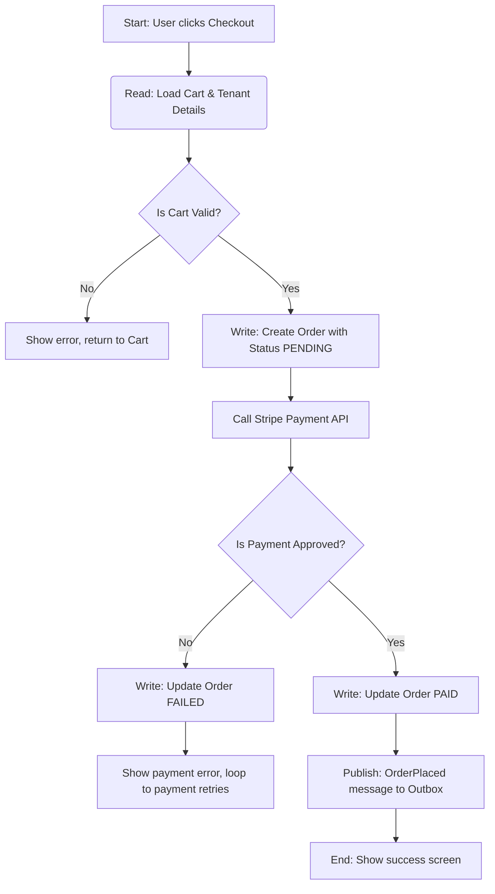

# User Flows

## 1. Definition & Core Concepts
User Flows are chronological path models (diagrams or step-by-step descriptions) that outline the sequential steps a user takes through an application to complete a specific task or transaction.

Core concepts:
- **Happy Path:** The optimal sequence of steps required to complete a task with zero errors or deviations.
- **Alternative Paths:** Alternative execution paths the user can take to complete the task (e.g. paying with credit card vs Apple Pay).
- **Exception/Error Paths:** Step sequences followed when things go wrong (e.g., card declined, validation error), detailing how the user recovers.
- **Decision Points:** Interaction nodes where a user must make a choice that branches the flow path.

## 2. Why It Exists / What Problem It Solves
Backend developers often write database transaction code and API routes in isolation. Without a user flow, they miss critical intermediate states (such as pending status codes, redirect loops, and validation errors) that must be handled by the database schema and application logic. User Flows map the end-to-end user path, ensuring the database schema has the columns and states required to capture every step.

## 3. What Goes Wrong on a Project Without It
- **Missing Database States:** The backend is built to expect a binary transaction state (Paid/Unpaid). In production, users close their browsers during redirection, leaving payments in a "Pending Verification" state. Because the database lacks columns or enums for this state, the order fails or gets lost.
- **Dead-End Error States:** When a transaction fails, the application does not provide a recovery path. The user is left stuck on an error page, forcing them to refresh and submit duplicate orders.
- **Unnecessary Database Roundtrips:** Designing a user profile flow that requires querying the database across 5 separate pages instead of grouping inputs and running a single transaction.
- **Security Validation Gaps:** Forgetting to place authentication checks at critical branch points, exposing restricted routes to unauthorized users.

## 4. Best Practices
- **Define Happy, Alternative, and Exception Paths:** For every major user task, document how it succeeds, how it deviates, and how it handles errors.
- **Map Flows Chronologically:** Organize flows in logical order: trigger, action, system verification, database commit, user feedback.
- **Use Mermaid Diagrams:** Create visual path flows using Mermaid syntax in documentation files to make dependencies clear.
- **Identify Database Mutations at Each Step:** Explicitly document where database writes and reads occur in the flow:
  - *Example:* "Step 3: User submits payment → Write pending invoice row → Call Stripe API."
- **Keep Flows Focused:** Create distinct flows for key actions (e.g., checkout, signup, password reset) instead of trying to map the entire product in a single diagram.

## 5. Common Mistakes / Anti-Patterns
- **Happy Path Only Design:** Designing the application assuming network calls never fail and users never make typos.
- **Too Granular UI Steps:** Mapping individual button clicks and hover animations rather than logical transaction checkpoints.
- **Undocumented Database Writes:** Failing to identify where data is written to disk, leading to database schema mismatches.
- **No Error Recovery Steps:** Leaving error nodes without loops back to previous active entry states.

## 6. How It Constrains/Informs Downstream Decisions
- **System Design:** Multi-step transactional checkout flows require backend state management (such as draft orders) and idempotency keys to prevent duplicate payments.
- **Backend Architecture:** Long alternative checkout paths require asynchronous processing queues rather than blocking synchronous API loops.
- **Database Design:** The states identified in user flows dictate the database table columns, state enums (`CREATE TYPE status_enum`), and constraints required to secure data integrity.

## 7. What "Good" Looks Like
A high-quality user flow is chronologically complete and traces the happy path, alternative options, and error recovery routes. It lists every decision node and explicitly identifies the corresponding database read/write checkpoints.

## 8. How Major Companies/Teams Do It
- **Uber:** Maps driver onboarding flows to trace background verification delays, configuring database state tables to manage document submission checkpoints.
- **Stripe:** Outlines payment intents flows showing checkout updates, ensuring connection states are saved before call transactions complete.

## 9. Decision Checklist
Go **Deep** (comprehensive user flows) when:
- Designing checkout, billing, and checkout flows.
- Multi-step wizards or complex data input flows are required.
- Multiple user roles interact in a shared flow (e.g. buyer triggers, seller approves).

Keep it **Lightweight** when:
- Creating simple, single-page read dashboards.
- Modifying existing features with no state changes.

## 10. AI Coding-Agent Implementation Guidelines
When a user requests a transactional feature:
1. **Define the Steps:** Ask: "What are the exact steps a user takes to complete this transaction? What happens if it fails?"
2. **Identify Branch Choices:** Ask: "What decisions or alternative routes can the user select?"
3. **Map DB Checkpoints:** Trace where database writes occur and document them.
4. **Produce User Flows Artifact:** Generate a Mermaid-based flow document using the template below.

## 11. Reusable Checklist
- [ ] End-to-end user path mapped chronologically
- [ ] Happy path, alternative paths, and error recovery loops documented
- [ ] Decision points and logical branches defined clearly
- [ ] Database read and write checkpoints identified for each step
- [ ] Database state columns and enums mapped to user flow statuses
- [ ] Authentication and security checks placed at entry checkpoints
- [ ] Mermaid diagrams used to visualize path transitions
- [ ] Error states include recovery loops back to input states

## 12. Output Template
```markdown
# User Flows: [Project Name]

### Flow 1: [Task Name, e.g. User Checkout & Payment]

#### 1. Visual Flow Diagram


#### 2. Chronological Step Walkthrough
1. **Trigger:** User clicks "Pay Now" on the checkout screen.
2. **Step 1 (Read Checkpoint):** System queries `cart` and `inventory` tables to verify stock availability.
3. **Step 2 (Write Checkpoint):** System writes an `order` row with state `PENDING_PAYMENT` and records an idempotency key.
4. **Step 3 (Integration Call):** Application communicates with Stripe API.
5. **Step 4 (Branch - Success/Failure):**
   - *If Approved:* Update `order` status to `PAID`, record payment token, and write transaction outbox event.
   - *If Failed:* Update `order` status to `PAYMENT_FAILED` and redirect user to payment retry page.
```
