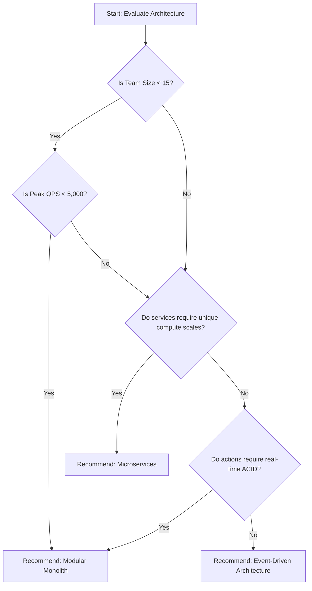

# Architecture Decision Tree

## 1. What Question This Answers
"What is the structured logic path (decision tree) used to select the optimal system architecture (Monolith, Modular Monolith, Microservices, Event-Driven) based on requirements, scale, and constraints?"

## 2. Why It Matters at the System-Design Stage
Selecting an architecture style based on assumptions or industry trends leads to project failures. Early-stage projects can get bogged down in microservice complexities, while high-scale enterprise platforms can outgrow simple monoliths. An Architecture Decision Tree provides a structured, logical framework. By evaluating criteria (team size, QPS, reliability) in order, it guides the architect to the most appropriate system design, preventing over-engineering and aligning tech choices with business constraints.

## 3. Methodology / How to Work Through It
Evaluate the decision tree nodes in sequential order:
1. **Node 1: Team Scale:** Is the development team size $<15$ engineers?
   - *Yes:* Stay in the Monolith/Modular Monolith path.
   - *No (e.g. >25 engineers):* Proceed to evaluate Microservices.
2. **Node 2: Target QPS & Storage:** Can the traffic workload run on a single database instance (<5,000 QPS)?
   - *Yes:* Monolithic patterns are viable.
   - *No:* Proceed to Microservices or Event-Driven architectures.
3. **Node 3: Modularity Requirements:** Is there a clear business roadmap to split services later, or do distinct sub-teams own different domains?
   - *Yes:* Propose a Modular Monolith as a starting point.
   - *No:* Standard Monolith is sufficient.
4. **Node 4: Data Consistency:** Do operations require real-time ACID transactions across domains?
   - *Yes:* Use Monolithic or Modular Monolith designs.
   - *No:* Event-Driven asynchronous patterns are viable.

## 4. Inputs Needed
- Team sizes, budgets, and project timelines from [Business Constraints](file:///c:/Users/mahip/OneDrive/Desktop/skills/01-system-design/01-requirement-analysis/business-constraints-analysis.md).
- Target peak QPS and transaction profiles.

## 5. Outputs Produced
- Feeds directly into [Architecture Comparison](file:///c:/Users/mahip/OneDrive/Desktop/skills/01-system-design/03-architecture-selection/architecture-comparison-decision-matrix-strategy-implementation.md) and final system proposals.

## 6. Worked Example (Standard SaaS Startup MVP)
- **Inputs:** Team = 5 developers, Timeline = 2 months, Target QPS = 200 peak.
- **Evaluation:**
  - *Team Scale (<15)?* Yes $\rightarrow$ Monolith path.
  - *Data Consistency required?* Yes $\rightarrow$ Relational database.
  - *Future extraction likely?* Yes, payments module might be isolated later.
- **Decision Path:** Propose a **Modular Monolith**. It guarantees in-memory speed and simple deployment for the 5-developer team, while keeping domain interfaces clean for future extraction.

## 7. Common Mistakes
- **Hype-Driven Decisions:** Bypassing the decision tree to use microservices because "major tech companies use them."
- **Ignoring Team Size Constraints:** Selecting microservices for a 2-developer team, wasting resources on Docker/Kubernetes setups.
- **Skipping the Modular Monolith:** Moving directly from a standard monolith to microservices, without checking modular separations.

## 8. AI Coding-Agent Guidelines
1. **Audit Team and Time constraints:** Read business constraint files before evaluating architecture types.
2. **Follow the Decision Tree Paths:** Use the structured logic paths to recommend monoliths or microservices.
3. **Produce Decision Tree Artifact:** Generate the page using the template below.

## 9. Reusable Template
```markdown
# Architecture Selection Decision Log: [System Name]

### 1. Decision Logic Path (Mermaid Chart)


### 2. Decision Tree Evaluation
- **Step 1: Team Size check:** [e.g. Team size is 6 engineers, choosing Monolith/Modular Monolith path.]
- **Step 2: Traffic Load check:** [e.g. Peak QPS projected at 300, fits within single-node limits.]
- **Step 3: Modularity check:** [e.g. Domains are highly decoupled; choose Modular Monolith over Standard Monolith to keep schemas isolated.]

### 3. Final Architecture Choice
- **Choice:** **Modular Monolith**
- **Justification:** Optimizes development speed for the small team while keeping domain interfaces clean.
```
