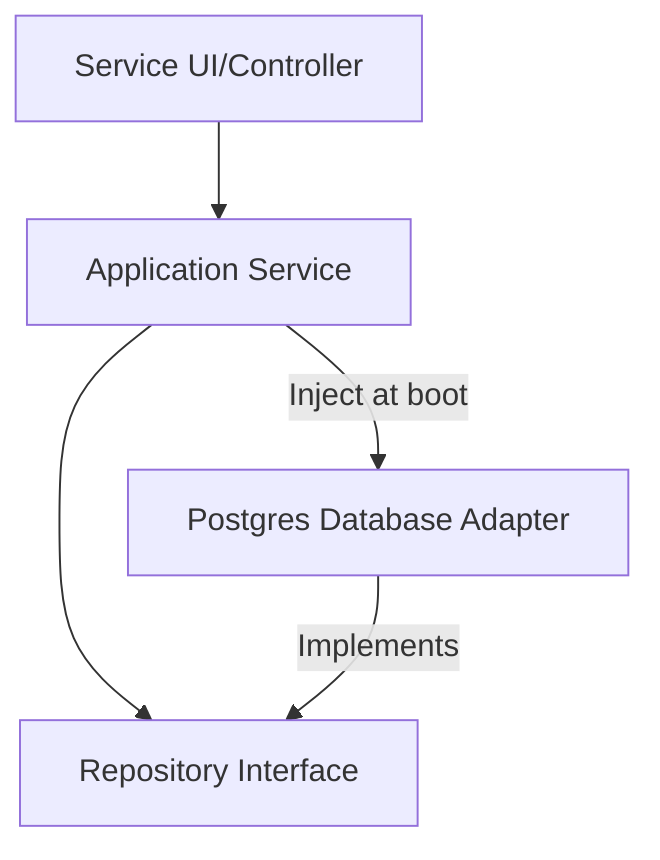

# Dependency Design

## 1. What Question This Answers
"How do we manage and map code dependencies between service modules, preventing tight coupling and circular dependencies while enforcing the Dependency Inversion Principle?"

## 2. Why It Matters at the System-Design Stage
If code dependencies are poorly designed, changes in one module propagate across the entire system, causing compilation errors and breaking features. Furthermore, tight coupling makes testing impossible because components cannot be isolated or mocked. Dependency design maps code boundaries, enforces the Dependency Inversion Principle (high-level logic should not depend on low-level details; both should depend on abstractions), and ensures components remain modular.

## 3. Methodology / How to Work Through It
1. **Map Code Relationships:** Audit module imports to identify dependencies.
2. **Apply Dependency Inversion Principle (DIP):** Introduce interface abstractions between components. High-level modules interact with interfaces, while low-level modules implement them.
3. **Configure Dependency Injection (DI):** Use DI containers (e.g. NestJS, Spring, or simple factories) to inject concrete implementations at runtime.
4. **Identify and Eliminate Circular Dependencies:** Block import loops using static code analyzers.
5. **Standardize Shared DTOs:** Create simple, immutable Data Transfer Objects (DTOs) to pass data across boundaries, avoiding passing database entities.

## 4. Inputs Needed
- Module layouts from Module Design.
- Chosen architecture style.

## 5. Outputs Produced
- Feeds into Communication Patterns and code configurations.

## 6. Worked Example (User Billing Integration)
- **Problem:** `UserService` must notify `BillingService` when a user register. Hardcoding a direct dependency: `BillingService billing = new BillingService();` inside `UserService` couples them.
- **Dependency Inversion Design:**
  - `UserService` defines an outbound port interface: `UserRegisteredPublisher` (declares `publish(user)`).
  - `UserService` calls the interface on registration.
  - `BillingService` (or an integration adapter) implements `UserRegisteredPublisher`.
  - At boot, the Dependency Injection container injects the adapter into `UserService`, decoupling them.

## 7. Common Mistakes
- **Direct Instantiation:** Hardcoding `new` keyword calls to instantiate dependent service classes, bypassing interfaces and DI frameworks.
- **Circular Imports:** Designing systems where Module A imports B, B imports C, and C imports A, causing compilation lockups.
- **Passing Database Entities:** Sharing live ORM model files across boundaries, leaking database schema details.

## 8. AI Coding-Agent Guidelines
1. **Never use `new` for Services:** Instantiate services using Dependency Injection templates.
2. **Abstract Boundaries:** Write interface ports between modules.
3. **Map DI Wiring:** Include DI configurations (e.g. decorators) in generated code.
4. **Produce Dependency Design Page:** Generate the artifact using the template below.

## 9. Reusable Template
```markdown
# Dependency Design & Injection Spec: [System Name]

### 1. Dependency Diagram (Mermaid)


### 2. Boundary Interface Contracts
- **Interface Port:** `OrderRepository` interface.
- **Consumer:** `CreateOrderUseCase` depends on `OrderRepository`.
- **Provider:** `PgOrderRepositoryAdapter` implements `OrderRepository`.

### 3. Dependency Injection Configuration
- **Framework Pattern:** [e.g. Constructor injection using NestJS Dependency Injection container]
- **Binding Registry:**
  - Bind `OrderRepository` interface to `PgOrderRepositoryAdapter` class (in production profile).
  - Bind `OrderRepository` to `MockOrderRepository` (in test profile).
```
