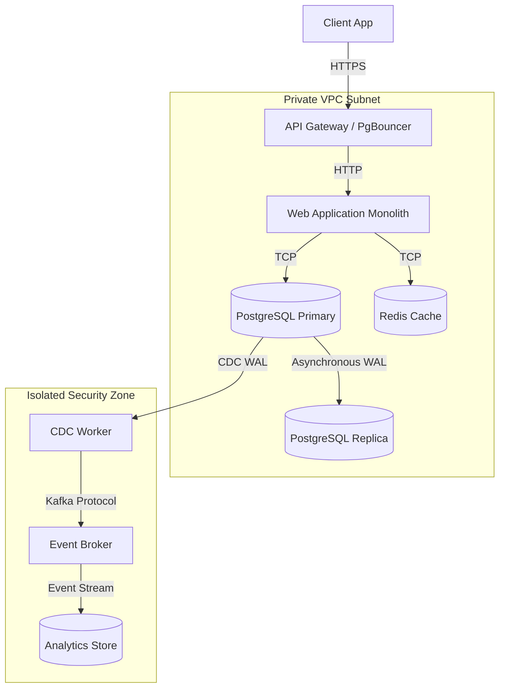
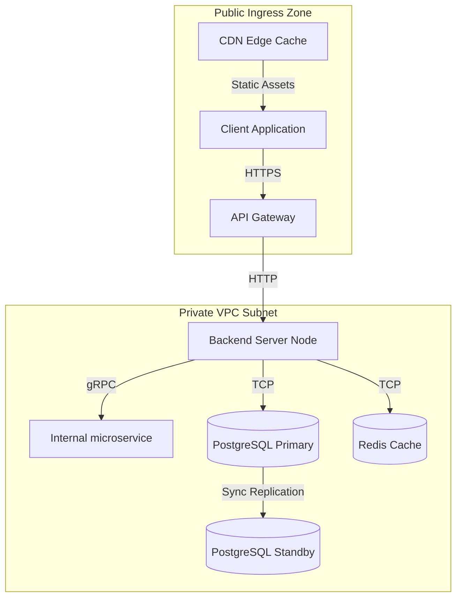

# Diagrams (System Architecture Diagrams)

## 1. What Question This Answers
"How do we visually model our system components, databases, network boundaries, API routes, and event brokers using standard diagram formats (Mermaid) to align engineering teams?"

## 2. Why It Matters at the System-Design Stage
Text specifications alone cannot fully convey complex distributed architectures. Without visual models, developers misinterpret boundaries: they write invalid network routes, fail to configure correct security subnet blocks, or misunderstand database replication paths. System architecture diagrams make component boundaries, connection protocols, and security zones visible. This aligns stakeholders and serves as the visual reference map for engineers.

## 3. Methodology / How to Work Through It
1. **Choose the Diagram Scope:** Map out:
   - *System Architecture:* Services, databases, gateways, network subnets (private vs public).
   - *Sequence Flows:* Chronological API and database call paths.
2. **Standardize on Mermaid Syntax:** Use Mermaid syntax inside Markdown documents, enabling diagram versioning in Git.
3. **Map Network Zones:** Explicitly separate public zones (Ingress, DNS, Gateways) from private subnets (Application servers, Database engines).
4. **Identify Protocols on Connections:** Tag connection arrows with their protocols (HTTP, gRPC, WebSocket, TCP replication).
5. **Mark Data Stores:** Represent database nodes, caches, and queues explicitly.

## 4. Inputs Needed
- Service boundary mappings and protocol selections from [Communication Patterns](file:///c:/Users/mahip/OneDrive/Desktop/skills/01-system-design/04-component-design/communication-patterns-strategy-implementation.md).
- Security strategy mandates.

## 5. Outputs Produced
- Feeds into [Data Flow Design](file:///c:/Users/mahip/OneDrive/Desktop/skills/01-system-design/05-data-flow-design/index.md) and deployment blueprints.

## 6. Worked Example (Standard SaaS Architecture Diagram)
- **Visual Model (Mermaid):**


## 7. Common Mistakes
- **Hiding Security Boundaries:** Failing to document private vs public subnets, leading to databases being exposed to public IPs.
- **Vague Connection Lines:** Drawing arrows without labeling protocols (e.g. not specifying if a call is REST, gRPC, or WebSocket).
- **Out-of-Date Static Images:** Uploading static PNG files to wikis that drift from the codebase. Use text-based Mermaid code instead.

## 8. AI Coding-Agent Guidelines
1. **Use Mermaid Syntax:** Always write diagrams in text-based Mermaid code.
2. **Explicit Subnets:** Group components into private and public subnets.
3. **Label Connection Protocols:** Always add protocol tags to connection lines.
4. **Produce System Diagrams Page:** Generate the page using the template below.

## 9. Reusable Template
```markdown
# System Architecture Diagrams: [System Name]

### 1. High-Level Component Topology (Mermaid)


### 2. Network Interface Catalog
- **Gateway Ingress:** Port `443` (HTTPS public), routes to Port `80` (HTTP private).
- **Database Subnet:** Port `5432` (restricted strictly to AppServer IP subnet).
- **Cache Subnet:** Port `6379` (isolated within Private VPC).
```
