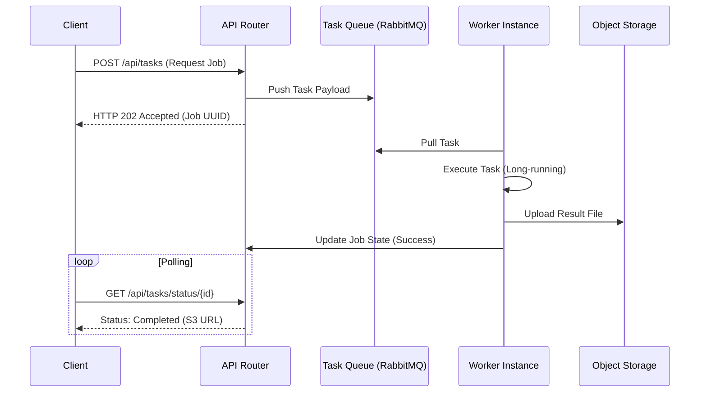

# Asynchronous Flow

## 1. What Question This Answers
"How are long-running, non-blocking processes (background jobs, notifications, data reports) offloaded from user-facing request paths, and how do we monitor their executions?"

## 2. Why It Matters at the System-Design Stage
Blocking API threads while executing slow, external HTTP tasks (e.g. charging cards, generating PDFs, mailing alerts) exhausts server resources and triggers connection timeouts. Asynchronous flow design offloads these tasks to background queues, keeping APIs highly responsive. It defines how requests are queued, how workers process tasks, and how clients are notified of completion.

## 3. Methodology / How to Work Through It
1. **Identify Slow Path Operations:** Locate tasks taking $>100\text{ms}$ or relying on third-party HTTP calls.
2. **Design Queue Ingress:** Write API routes that accept requests, push a job payload to a task queue, and instantly return HTTP 202 Accepted.
3. **Configure Worker Clusters:** Design isolated worker nodes that pull jobs from queues and execute tasks.
4. **Implement Client Notification Polling:** Choose notification methods for clients:
   - *Short Polling:* Client repeatedly queries status endpoint.
   - *WebSockets / SSE:* Server pushes update dynamically.
5. **Manage Concurrency Limits:** Rate-limit worker loops to prevent exhausting external API keys or databases.

## 4. Inputs Needed
- Latency and throughput limits from [Non-Functional Requirements](file:///c:/Users/mahip/OneDrive/Desktop/skills/01-system-design/01-requirement-analysis/non-functional-requirements-analysis.md).
- Service boundaries and communication maps.

## 5. Outputs Produced
- Feeds into [Message Queue Strategy](file:///c:/Users/mahip/OneDrive/Desktop/skills/01-system-design/11-message-queue-strategy/index.md) and [Backend Strategy](file:///c:/Users/mahip/OneDrive/Desktop/skills/01-system-design/07-backend-strategy/index.md).

## 6. Worked Example (User PDF Report Request)
- **Request:** User clicks "Download Annual Tax Report". Processing the PDF takes 12 seconds.
- **Async Flow:**
  - *Ingress:* User hits `POST /api/reports/generate`.
  - *Queue:* Backend inserts job entry `(job_id, status='PENDING')` to database, pushes `job_id` to RabbitMQ, and returns HTTP 202 with `job_id`.
  - *Worker:* Python worker pulls `job_id`, runs PDF creation, saves file to S3, and updates database: `status='COMPLETED'`.
  - *Polling:* Client UI queries `/api/reports/status/job_id` every 2 seconds. When status is `COMPLETED`, UI downloads S3 URL.

## 7. Common Mistakes
- **Blocking API Threads:** Executing slow database aggregations or external calls synchronously inside user-facing request loops.
- **No Job State Auditing:** Pushing tasks to queues without saving job states in a database, making it impossible to debug failed jobs.
- **Unbounded Worker Concurrency:** Allowing workers to run infinitely, saturating primary database connections or triggering third-party rate limits.

## 8. AI Coding-Agent Guidelines
1. **Identify Slow Operations:** Offload any tasks taking >100ms to background worker queues.
2. **Instant Returns:** Instruct API endpoints to return HTTP 202 immediately after queueing tasks.
3. **Propose Polling/WebSockets:** Include status checking mechanisms in API designs.
4. **Produce Asynchronous Flow Page:** Generate the page using the template below.

## 9. Reusable Template
```markdown
# Asynchronous Task Flow Spec: [System Name]

### 1. Job Lifecycle Flow (Mermaid Sequence)


### 2. Offloaded Task Inventory
- **Task A (e.g. PDF Invoice Generator):**
  - *Trigger Route:* `POST /api/invoices/generate`
  - *Queue Store:* RabbitMQ Queue `invoice-generation-tasks`.
  - *Average Duration:* [e.g. 5 seconds]

### 3. Worker Sizing Limits
- **Max Concurrent Worker Jobs:** [e.g. Capped at 10 concurrent runs per node to protect database connection pools.]
- **Worker Scale triggers:** Scale worker container count if queue size > 50 messages for 2 minutes.
```
