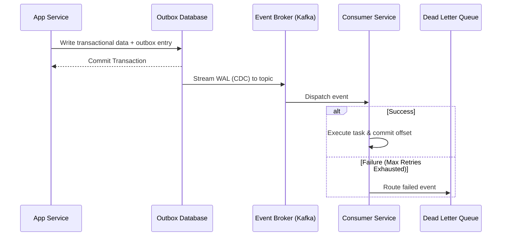

# Event Flow

## 1. What Question This Answers
"How do events travel across components asynchronously, and how do we ensure reliable transmission, routing, and processing across brokers and queues?"

## 2. Why It Matters at the System-Design Stage
In asynchronous systems, event delivery failures are common: brokers crash, network partitions occur, and consumer servers run out of resources. Without mapping the event flow, developers fail to implement reliability patterns: they lose messages, suffer out-of-order execution, or double-process transactions. Event flow design maps the exact lifecycle of messages, integrating outbox tables, retry brokers, dead letter queues (DLQs), and concurrency boundaries.

## 3. Methodology / How to Work Through It
1. **Identify the Event Source:** Document the transactional write that generates the event.
2. **Design the Publishing Step:** Prevent message loss by saving event records to an outbox table within the database transaction boundary.
3. **Map the Routing Broker:** Define how events are routed through queues (topics, exchanges).
4. **Design the Processing Lifecycle:** Map how consumer services fetch, validate, and execute events.
5. **Configure Failure Recoveries:** Define retry timeouts and dead letter queues (DLQs) for failed events.

## 4. Inputs Needed
- Asynchronous constraints from Event-Driven Architecture.
- Target peak write throughput metrics.

## 5. Outputs Produced
- Feeds into [Message Queue Strategy](../../13-architecture-decision-records/index.md) and [Design Patterns Strategy](../../13-architecture-decision-records/index.md).

## 6. Worked Example (Order Processing Pipeline)
- **Source:** Checkout API completes purchase database transaction.
- **Publish:** System writes order to DB and inserts event payload to `event_outbox` table.
- **Broker Route:** CDC engine streams outbox insert to Kafka topic `orders.paid`.
- **Consumer Flow:** `ShippingService` consumes event, validates payload, and creates delivery record.
- **Failure Flow:** If shipping API is down:
  - Shipping consumer retries event processing 3 times (with exponential backoff).
  - If retries are exhausted, the message is routed to DLQ topic `orders.paid.dlq` and an alert is sent.

## 7. Common Mistakes
- **No Transactional Publishing:** Publishing messages directly to brokers inside database transactions, risking data inconsistency if database commits rollback.
- **Infinite Retry Loops:** Failing to cap retry attempts, causing consumer nodes to loop on corrupted event payloads indefinitely.
- **No DLQ Alerting:** Setting up dead letter queues but failing to configure alerting notifications, leaving failed messages unnoticed.

## 8. AI Coding-Agent Guidelines
1. **Enforce Transactional Outbox:** Always pair event stream publishers with outbox tables.
2. **Cap Retries:** Set maximum retry limits (e.g. 3 attempts) and specify DLQ fallbacks.
3. **Specify Partition Keys:** Define partition keys to preserve event ordering (e.g. partition by `order_id`).
4. **Produce Event Flow Page:** Generate the page using the template below.

## 9. Reusable Template
```markdown
# Event Flow & Reliability Spec: [System Name]

### 1. Event Flow Sequence (Mermaid Sequence)


### 2. Event Routing Catalog
- **Event Name:** `[e.g., billing.charge_succeeded]`
- **Publisher:** [e.g. Billing Service]
- **Target Topic:** `[e.g., billing-charge-events]`
- **Partition Key:** `[e.g. user_id (guarantees transaction order per user)]`

### 3. Reliability Configurations
- **Retries Limit:** [e.g. 3 retries, exponential backoff (2s, 4s, 8s)]
- **Dead Letter Queue (DLQ):** [e.g. Failed events written to `billing-charge-events.dlq`]
```
