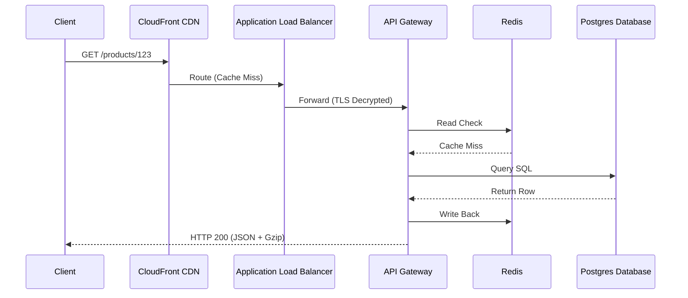

# Request Flow

## 1. What Question This Answers
"What is the physical and logical path of a client request from edge DNS servers to application hosts and back, and what network components process this flow?"

## 2. Why It Matters at the System-Design Stage
Without mapping the request flow, developers make assumptions about network routes: they might configure direct connections to database engines, ignore proxy pools, or fail to design SSL termination zones. Request flow mapping details the ingress routing path, ensuring that:
- Load balancers terminate SSL and distribute traffic evenly.
- API gateways route requests, rate-limit clients, and log telemetries.
- Applications query caching layers before hitting primary databases.

## 3. Methodology / How to Work Through It
1. **Trace Client Lookup:** Identify how the client resolves DNS names (Anycast DNS, Edge CDNs).
2. **Define Ingress Gateway Path:** Map routing through the Load Balancer (SSL decryption) and API Gateway (rate-limiting, security).
3. **Map Application Logic Routing:** Detail how request paths route to backend VM containers.
4. **Define Database and Cache Checkpoints:** Map how the application reads from cache (Redis) and queries primary databases.
5. **Trace Egress Response path:** Document how response data flows back to the client, utilizing compression.

## 4. Inputs Needed
- Latency and throughput requirements from Latency Requirements.
- System architecture diagrams.

## 5. Outputs Produced
- Feeds into Event Flow and [API Strategy](../../13-architecture-decision-records/index.md).

## 6. Worked Example (Standard REST Catalog Request)
- **Request:** `GET /products/123`
- **Flow Steps:**
  1. *DNS/CDN:* Client resolves URL. Edge CDN (CloudFront) checks for cached response. If cache miss:
  2. *Load Balancer (ALB):* Requests hit ALB, decrypting TLS.
  3. *API Gateway:* ALB forwards request to Kong API Gateway, verifying authorization headers.
  4. *App Server:* Gateway routes request to Node.js backend container.
  5. *Cache:* Backend checks Redis key `prod_123`. If miss:
  6. *DB Query:* Backend queries PostgreSQL: `SELECT * FROM product WHERE id = 123`.
  7. *Write Back:* Backend writes result back to Redis, serializes payload to JSON, compresses (gzip), and returns response through the gateway to the client.

## 7. Common Mistakes
- **Bypassing the API Gateway:** Allowing client apps to query backend application nodes directly without rate-limiting gates.
- **Ignoring CDN Edge caching:** Routing every static asset request directly through to primary application nodes, saturating network interfaces.
- **No TLS Decryption Sizing:** Placing heavy TLS decryption loads on application containers instead of offloading it to hardware load balancers.

## 8. AI Coding-Agent Guidelines
1. **Force API Gateways:** Always position an API gateway between client apps and backend nodes.
2. **Recommend Cache-Aside:** Include caching lookups on read-heavy routes.
3. **Specify Encryption Boundaries:** Configure load balancers to terminate TLS.
4. **Produce Request Flow Page:** Generate the artifact using the template below.

## 9. Reusable Template
```markdown
# Request Ingress Flow Specification: [System Name]

### 1. Request Path Diagram (Mermaid)


### 2. Ingress Component Parameters
- **Edge CDN Routing:** Static assets served via CloudFront CDN.
- **API Rate Limiter:** Maximum 50 requests/minute per client IP enforced at Kong Gateway.
- **Cache Policy:** Cache TTL set to 300 seconds for read-heavy routes.
```
