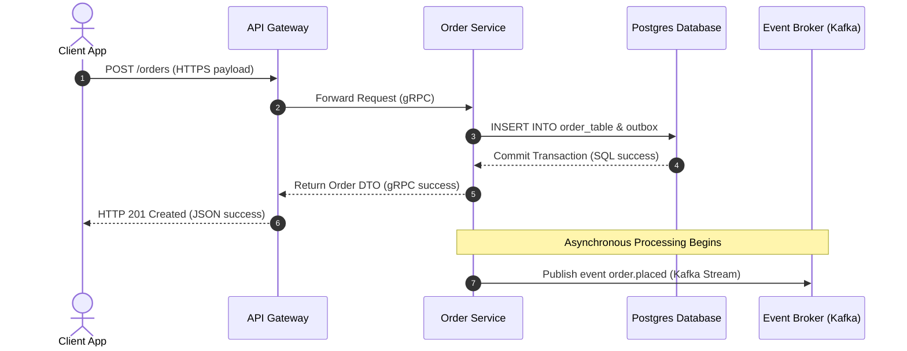

# Sequence Diagrams

## 1. What Question This Answers
"What is the chronological sequence of messages, API requests, database queries, and notifications required to execute our system's primary user transactions?"

## 2. Why It Matters at the System-Design Stage
In distributed systems, operations run concurrently, making race conditions and latency hops common. Sequence diagrams model the step-by-step chronology of interactions across component boundaries (Client, Gateways, Microservices, Databases, Brokers). This exposes:
- Circular API dependency paths.
- Unnecessary database round-trips.
- Where asynchronous messaging can be substituted for synchronous hops to save latency budgets.

## 3. Methodology / How to Work Through It
1. **Identify the Core Transactions:** Select primary user actions (e.g. checkout, register, search).
2. **Define Participants:** List the actors and systems involved in the transaction lifecycle.
3. **Trace the Sequence Chronologically:** Draw vertical lifelines for each participant, mapping messages as horizontal arrows.
4. **Identify Sync vs Async Calls:** Draw synchronous calls as solid arrows with solid returns, and asynchronous events as dashed arrows.
5. **Mark Database Mutations:** Explicitly show when and where SQL writes, cache checks, and transaction commits occur.

## 4. Inputs Needed
- Component interaction flows from Component Interactions.
- Selected communication protocols.

## 5. Outputs Produced
- Feeds into Workflow Design and backend controller integrations.

## 6. Worked Example (User Signup Notification Sequence)
- **Sequence steps:**
  - Client submits POST `/users` to API Gateway.
  - Gateway routes to User Server.
  - User Server checks cache, writes user details to Postgres DB, and inserts registration event to the outbox.
  - User Server returns HTTP 201 to the Gateway, which returns to the client.
  - Outbox worker picks up the event, streaming it to Kafka.
  - Email Server consumes Kafka event, triggering SendGrid API asynchronously.

## 7. Common Mistakes
- **Vague Participant Lifelines:** Grouping all backend code into a single "Backend" node, hiding service-to-service interaction details.
- **Ignoring Failures Paths:** Only mapping the "happy path," ignoring error responses, timeout dropouts, or database rollbacks.
- **Mixing Levels of Altitude:** Mixing low-level class method details (e.g. `User.setPassword()`) with high-level network protocol hops (e.g., `POST /users`). Keep sequence diagrams focused on system-level interactions.

## 8. AI Coding-Agent Guidelines
1. **Use Mermaid Sequence Diagrams:** Always write diagrams in text-based Mermaid sequence syntax.
2. **Explicitly Label Hops:** Tag connection arrows with their protocol (HTTPS, gRPC, TCP, Kafka).
3. **Map Async Breaks:** Clearly delineate where synchronous wait loops terminate and asynchronous processing begins.
4. **Produce Sequence Diagrams Page:** Generate the page using the template below.

## 9. Reusable Template
```markdown
# Transaction Sequence Diagrams: [System Name]

### 1. Primary Transaction Sequence: [Transaction Name, e.g. Checkout]


### 2. Transaction Flow Rules
- **Sync Timeout Window:** Step 1 to Step 6 must execute in under [e.g. 200ms].
- **Async Latency Target:** Step 7 (Kafka publish) must execute within [e.g. 500ms] of database commit.
```
