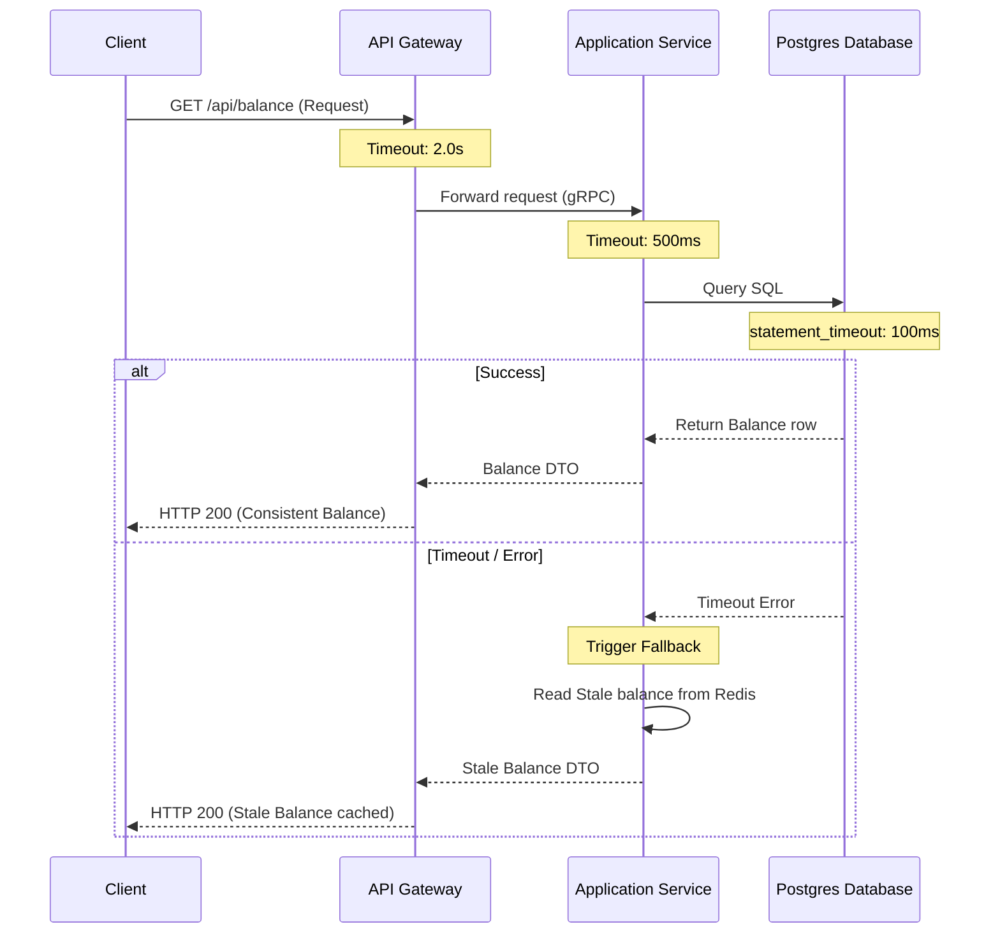

# Sync Flow

## 1. What Question This Answers
"How do synchronous, blocking operations (user auth, item checkout, balance checks) execute across service layers under strict timeout limits and error boundary policies?"

## 2. Why It Matters at the System-Design Stage
Synchronous calls couple systems chronologically: the client blocks waiting for the server; the server blocks waiting for the database. If any node in the chain slows down or crashes, connections accumulate, exhausting threads and causing cascading failures. Sync flow design maps the blocking boundaries, enforces strict timeouts (e.g. abort database queries taking >50ms), and defines circuit breaker strategies to protect resources.

## 3. Methodology / How to Work Through It
1. **Identify Critical Sync Paths:** Map routes that require immediate, consistent transactional outputs (e.g., login, payment authorization).
2. **Deconstruct Latency Budgets:** Divide total latency limits across components on the path.
3. **Configure Connection Timeouts:** Set strict connect and read timeouts at each boundary:
   `Client -> (Timeout 3s) -> Gateway -> (Timeout 2s) -> App Server -> (Timeout 500ms) -> DB Query.`
4. **Define Circuit Breakers:** Wrap downstream network calls in circuit breakers (e.g. Hystrix/Resilience4j) to fail fast on network dropouts.
5. **Implement Fallback Behaviors:** Define default responses on errors (e.g. returning stale cached profiles if database is down).

## 4. Inputs Needed
- Latency budgets and connection parameters from [Latency Requirements](file:///c:/Users/mahip/OneDrive/Desktop/skills/01-system-design/01-requirement-analysis/latency-requirements-strategy-implementation.md).
- Bounded contexts map.

## 5. Outputs Produced
- Feeds into [API Strategy](file:///c:/Users/mahip/OneDrive/Desktop/skills/01-system-design/06-api-strategy/index.md) and [Reliability Strategy](file:///c:/Users/mahip/OneDrive/Desktop/skills/01-system-design/15-reliability-strategy/index.md).

## 6. Worked Example (User Balance Verification)
- **SLA Latency Budget:** P95 response < 100ms.
- **Sync Flow Path:**
  - *Client HTTP request:* `GET /api/wallet/balance`.
  - *API Gateway:* Verifies JWT token (10ms).
  - *Application:* Calls `WalletService` via gRPC (20ms connect timeout).
  - *Database:* Queries Postgres: `SELECT balance FROM wallets WHERE user_id = ?` (`statement_timeout = 30ms`).
  - *Fallback:* If gRPC fails or database times out, return stale cached balance from Redis (marked as "cached as of [time]") to keep page loading under 80ms.

## 7. Common Mistakes
- **Unbounded Timeouts:** Allowing HTTP or database connection threads to block indefinitely, saturating server resources during outages.
- **No Fallback Planning:** Crashing the client UI completely on minor database timeouts when stale cached read-only data is acceptable.
- **Cascading Failures:** Letting a slow down in a secondary service block the primary checkout API route due to shared thread pools.

## 8. AI Coding-Agent Guidelines
1. **Set Strict Timeouts:** Propose connection and query statement timeouts on all SQL and HTTP operations.
2. **Design Circuit Breakers:** Enforce circuit breakers on all external HTTP and RPC hops.
3. **Specify Fallbacks:** Include fallback strategies (e.g. cache queries) for read paths.
4. **Produce Synchronous Flow Page:** Generate the artifact using the template below.

## 9. Reusable Template
```markdown
# Synchronous Flow & Reliability Spec: [System Name]

### 1. Blocking Request Flow (Mermaid Sequence)


### 2. Timeout & Query Thresholds
- **Gateway connection Timeout:** [e.g. 2000ms]
- **Service gRPC Timeout:** [e.g. 500ms]
- **Database Statement Timeout:** [e.g. `SET statement_timeout = 100ms;`]

### 3. Circuit Breaker Parameters
- **Failure Threshold:** Trigger open when >50% of requests fail in a 10-second window.
- **Half-Open Retry Interval:** [e.g. 5 seconds]
```
