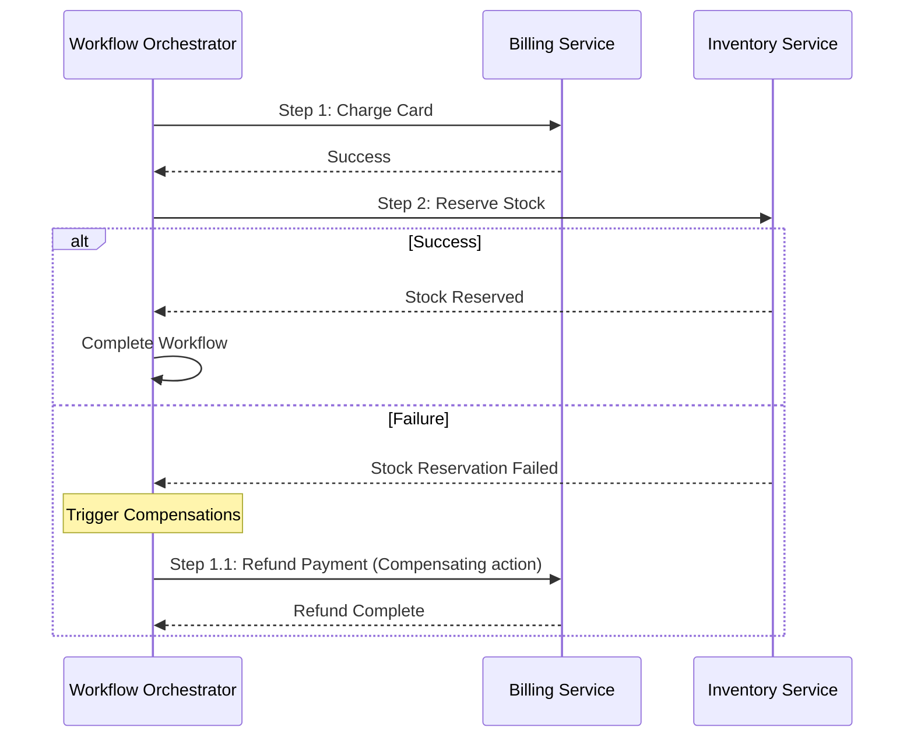

# Workflow Design

## 1. What Question This Answers
"How do we coordinate multi-step, distributed business workflows (e.g. order checkouts, inventory holds, card charges, shipping labels) across independent services while ensuring transactional consistency or clean rollbacks?"

## 2. Why It Matters at the System-Design Stage
A business workflow often spans multiple microservices. In distributed architectures, standard database ACID transactions are impossible because tables reside on physically distinct databases. If the system charges a user's card but the inventory hold fails, the system is in an inconsistent state (user charged, no product shipped). Workflow design maps the sequence of steps, chooses appropriate consistency patterns (Sagas vs. Orchestrators), and defines compensating actions to execute rollbacks when steps fail.

## 3. Methodology / How to Work Through It
1. **List the Steps of the Workflow:** Map the sequence of operations required to complete the business goal.
2. **Determine Consistency Requirements:** Decide if steps can be eventually consistent or require strict coordination.
3. **Select a Distributed Transaction Pattern:**
  - *Orchestrated Saga:* A centralized controller service coordinates the steps and instructs services to execute or rollback.
  - *Choreographed Saga:* Services listen to events on a message broker, executing their step and publishing output events.
4. **Define Compensating Transactions:** Write rollback operations for each step (e.g. refund payment if shipping label creation fails).
5. **Enforce Step Idempotency:** Ensure all services handle duplicate workflow step triggers safely.

## 4. Inputs Needed
- Bounded contexts definitions from [Service Boundaries](file:///c:/Users/mahip/OneDrive/Desktop/skills/01-system-design/04-component-design/service-boundaries-strategy-implementation.md).
- User flows and functional specs.

## 5. Outputs Produced
- Feeds into [Design Patterns Strategy](file:///c:/Users/mahip/OneDrive/Desktop/skills/01-system-design/19-design-patterns/index.md) and [Message Queue Strategy](file:///c:/Users/mahip/OneDrive/Desktop/skills/01-system-design/11-message-queue-strategy/index.md).

## 6. Worked Example (User Account Upgrade Workflow)
- **Workflow Goal:** Upgrade user to premium status.
- **Services involved:**
  - `BillingService`: Charges payment card.
  - `SubscriptionService`: Updates user state to `PREMIUM`.
  - `NotificationService`: Sends confirmation email.
- **Distributed Pattern (Orchestration):**
  - `UpgradeOrchestrator` triggers `BillingService.chargeCard()`. Success.
  - Orchestrator triggers `SubscriptionService.upgradeUser()`. Failure (database locked).
  - *Compensating Action:* Orchestrator calls `BillingService.refundCard()` and updates system log. Status remains `STANDARD`. User is notified of payment refund.

## 7. Common Mistakes
- **No Compensating Actions:** Designing distributed workflows that fail halfway through without rolling back completed steps, leaving corrupt data.
- **Tight Orchestrator Coupling:** Creating orchestrators that query downstream databases directly instead of calling service APIs.
- **Ignoring Eventual Consistency Latency:** Designing user dashboards that fail if a background workflow step takes more than 1 second to complete.

## 8. AI Coding-Agent Guidelines
1. **Identify Distributed Workflows:** Map any transaction that spans multiple databases.
2. **Propose Saga Orchestrator:** Recommend centralized orchestrators for complex multi-step workflows.
3. **Write Compensation Logic:** Include explicit rollback actions (compensations) for every workflow step.
4. **Produce Workflow Design Page:** Generate the artifact using the template below.

## 9. Reusable Template
```markdown
# Distributed Workflow Specification: [Workflow Name]

### 1. Workflow Sequence (Mermaid Sequence)


### 2. Workflow Step Matrix
| Step | Service | Happy Action | Compensating Action (Rollback) |
|---|---|---|---|
| **01** | Billing Service | `chargeCard(userId, amount)` | `refundCard(transactionId)` |
| **02** | Inventory Service | `reserveStock(itemId, qty)` | `releaseStock(reservationId)` |

### 3. Consistency Model
- **Target Pattern:** Orchestrated Saga (managed via dedicated Workflow Orchestrator).
- **Idempotency Strategy:** Every workflow run holds a unique `workflow_id` GUID. All step APIs verify `workflow_id` history before execution.
```
